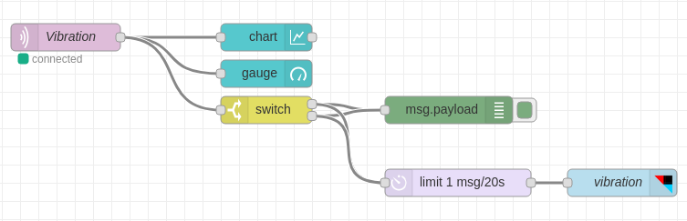
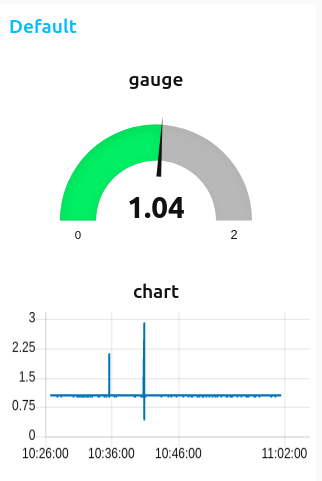

# Vibration

This is fork of [bcf-radio-vibration-monitor](https://github.com/bigclownprojects/bcf-radio-vibration-monitor).This repository contains firmware Vibration monitor for [Core Module](https://shop.bigclown.com/core-module).
This firmware sends the magnitude measured on the accelerometer. Normal value is around 1. If there is some unstability the value goes higher or lower.

## Node-red Dasboard

[Dashboard](node-red-dashboard.json).

## License

This project is licensed under the [MIT License](https://opensource.org/licenses/MIT/) - see the [LICENSE](LICENSE) file for details.

---

Made with &#x2764;&nbsp; by [**HARDWARIO s.r.o.**](https://www.hardwario.com/) in the heart of Europe.
